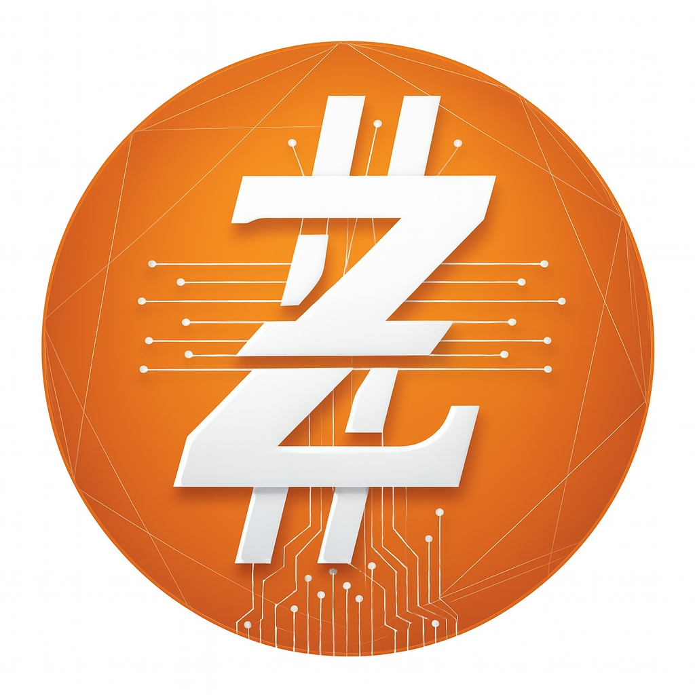

<h1 align="center">🔶 ZAIUM Chain</h1>

<strong>
Decentralize power. Shape the future. Sustain the world — block by block.
</strong>

  

---

🧩 Overview

ZAIUM Chain is an independent blockchain engineered for fast, secure and decentralized micropayments.
Built as a clean fork of Bitcoin, ZAIUM preserves the robustness of the Bitcoin architecture while introducing its own identity, parameters and long-term vision.

The project focuses on delivering a payment-optimized, transparent and resilient blockchain layer that remains simple, auditable and efficient.

🚀 Core Ecosystem

The ZAIUM ecosystem is composed of several planned components:

🟧 zaium-core – Full node implementation (PoW SHA-256, UTXO model).

🟦 zaium-wallet – Official non-custodial wallet (desktop & mobile).

🟪 zaium-explorer – Block explorer showcasing blocks, transactions and network metrics.

📄 zaium-whitepaper – Technical documentation, economics and system architecture.

All repositories will be open-source under the MIT license.

🔐 Technology Pillars

Proof-of-Work consensus (SHA-256)

UTXO architecture derived from Bitcoin

60-second block time

SegWit activated

Lightning-compatible design

Transparent and small premine (0.48%)

Efficient, stable and security-focused network core

🛠 Protocol Vision

ZAIUM aims to provide:

Reliable micropayments with low fees

A lightweight and decentralized infrastructure

Predictable tokenomics inspired by Bitcoin (halving cycles, fixed supply)

A transparent early-stage foundation for ecosystem tools and development

A long-term, sustainability-oriented blockchain layer

🌐 Official Links

Website: https://zaium.org

GitHub: https://github.com/zaium-chain

X (Twitter): https://twitter.com/zaiumchain

Telegram: https://t.me/zaiumchain

ZAIUM — Building the future, block by block.
